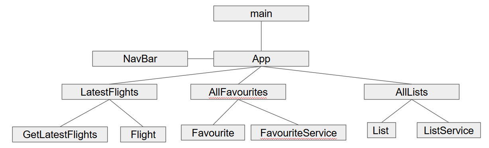

.env variables:

- VITE_AVIATIONSTACK_URI: the base uri for avation stack
- VITE_AVIATIONSTACK_APIKEY
- VITE_AIRTABLE_URI: base uri for airtable
- VITE_AIRTABLE_APITOKEN
- VITE_AIRTABLE_LIST_TABLE_ID: the ID for the metadata table that records the tables in the base
- VITE_AIRTABLE_BASE_ID
- VITE_AIRTABLE_BASE_URI
- VITE_AIRTABLE_DEFAULT_LIST_ID: the table to show during inital launch when no list has been selected for that session

